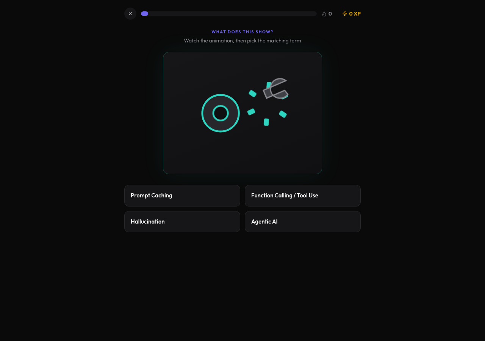

# AI Fact Checker

Verified information platform teaching what's truly happening under the hood of modern AI. Aggregates 50+ sources to fact-check models, providers, and capabilities across the industry.

**Live site:** https://web-tau-peach-63.vercel.app

Built by [Cade Kukk](https://cadekukk.vercel.app/) in collaboration with Dr. Blackwood and Professor Dolence at Longwood University.


## What's in this repo

| Path | Description |
|------|-------------|
| `web/` | The web application — Next.js (App Router), deployed to Vercel. This is the live, actively developed version. |
| `AI Fact Checker/` | The original SwiftUI iOS app the web version grew out of. |

## The web app

The front door is **Learn** — a 9-lesson animated mini-course (AI Fundamentals) that opens with an interactive walkthrough of the app itself: practice tapping highlighted terms (and chaining through definitions), explore a live map of the app's five sections, and try a working mini version of the global search. The rest of the course covers neural networks, language models, tokens, parameters, and how to spot AI misinformation. Course progress is saved locally, so returning visitors pick up where they left off.

Finishing AI Fundamentals unlocks **AI in Depth** (`/learn/advanced`) — a 7-lesson advanced course on transformer architecture, the training pipeline, reasoning and test-time compute, agents and MCP, benchmark literacy, AI security (jailbreaks vs. prompt injection), and the open-weight ecosystem. Every lesson is built around an interactive widget: run a forward pass through a 3D transformer layer stack, tap words in an attention playground, route tokens through a Mixture-of-Experts, compare the same prompt across training stages, turn a thinking-budget dial, watch an agent loop run, un-truncate a misleading launch chart, execute (and then block) a prompt-injection attack, and quantize a 70B model until it fits on a laptop.

After the course, **Knowledge Check** (`/learn/practice`) tests what stuck: a 10-question quiz on AI terminology in which every concept is illustrated by a hand-built animated visual. Questions alternate between "which term describes this concept?" and "what does this term refer to?", and each answer is followed by an explanation with the term's definition and a concrete example. 46 terms are in rotation — from foundations like neural networks, nodes, weights, and backpropagation up to current topics like MCP and data contamination — each with its own looping SVG scene; score, accuracy, streaks, and lifetime stats persist locally.



Behind it, four reference sections backed by a hand-curated, source-cited dataset:

- **Companies** (`/companies`) — 9 AI companies and 36 models (including Moonshot AI's Kimi K3, GPT-5.6 Sol, Claude Opus 5, Grok 4.5, and DeepSeek V4), each with specs, pricing, capabilities, known limitations, and myth vs. fact breakdowns.
- **Fact Check** (`/fact-check`) — 60 verified answers to common AI questions — from "Can AI think?" to energy use, copyright law, deepfakes, AI companions, self-driving, and political bias — each tagged with a confidence level that reflects the strength of available evidence.
- **Compare** (`/compare`) — side-by-side model comparison across quality, speed, context, value, and versatility, with transparent scoring.
- **Sources** (`/sources`) — 75+ primary sources behind every claim: official documentation, peer-reviewed and arXiv research papers, GitHub repositories, and news coverage.

A **⌘K search palette** covers everything — companies, models, fact-checked questions, and the full 83-term AI glossary, which opens in place from anywhere in the app. Terms are also inline-highlighted throughout.

Every page is a real URL, so lessons, model pages, comparisons, and searches are all shareable:

```text
/learn?lesson=3
/companies/moonshot/kimik3
/compare?models=kimik3,gpt56sol,claudeopus5
/fact-check?q=Can%20AI%20think%3F
```


### Design

Dark, clean, and minimal — inspired by [micro1.ai](https://www.micro1.ai/):

- Near-black surfaces (`#0a0a0a`) with subtle white-alpha cards and hairline borders
- Violet brand accent (`#7065f0`)
- [Outfit](https://fonts.google.com/specimen/Outfit) geometric sans throughout, soft 10–14px corner rounding
- Small uppercase violet section kickers above each page title


### Tech stack

- [Next.js](https://nextjs.org/) (App Router) with React and TypeScript
- [Tailwind CSS v4](https://tailwindcss.com/)
- [lucide-react](https://lucide.dev/) icons
- [Resend](https://resend.com/) for the feedback endpoint (`/api/feedback`)
- Deployed on [Vercel](https://vercel.com/)

### Running locally

```bash
cd web
npm install
npm run dev
```

Open http://localhost:3000.

The feedback form requires two environment variables (optional for local development — the endpoint degrades gracefully without them):

```bash
RESEND_API_KEY=...      # from resend.com
FEEDBACK_RECIPIENT=...  # inbox for feedback, defaults to the author's
```

### Deploying

The `web/` directory is linked to the Vercel project `web`. Pushes to `main` deploy automatically; a manual deploy is:

```bash
cd web
npx vercel --prod
```

## Data

All model specs, pricing, benchmarks, and claims live in `web/data/` as typed TypeScript modules (`companies.ts`, `factcheck.ts`, `terms.ts`, `benchmarks.ts`, `lessons.ts`, `advancedLessons.ts`). Every claim traces back to a source listed in the Sources tab.

The app version and data-freshness date live in one place — `web/lib/appMeta.ts` — and are shown in the sidebar footer and on the Learn home page. Model and company information is current as of **August 2026** (v0.5.1). AI moves fast; always verify against primary sources.
