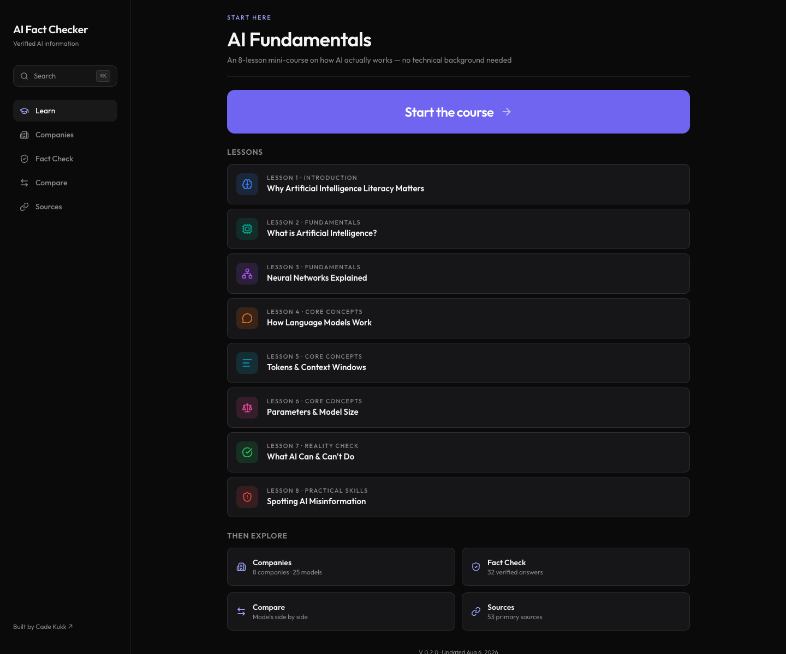
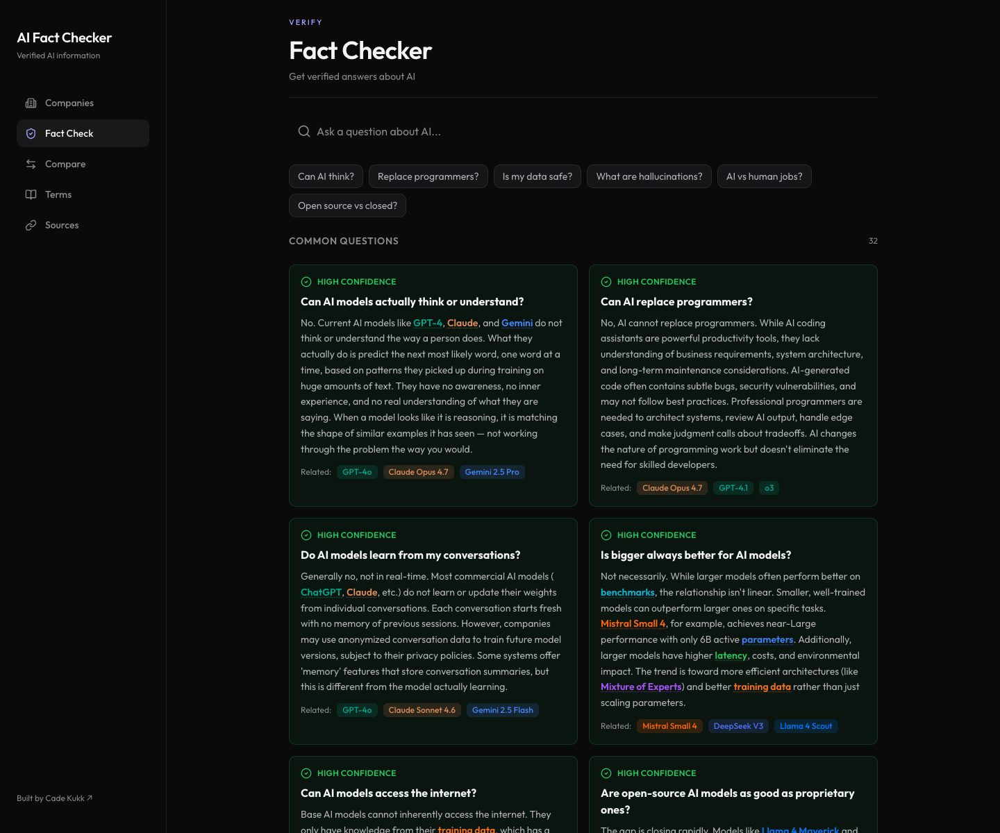
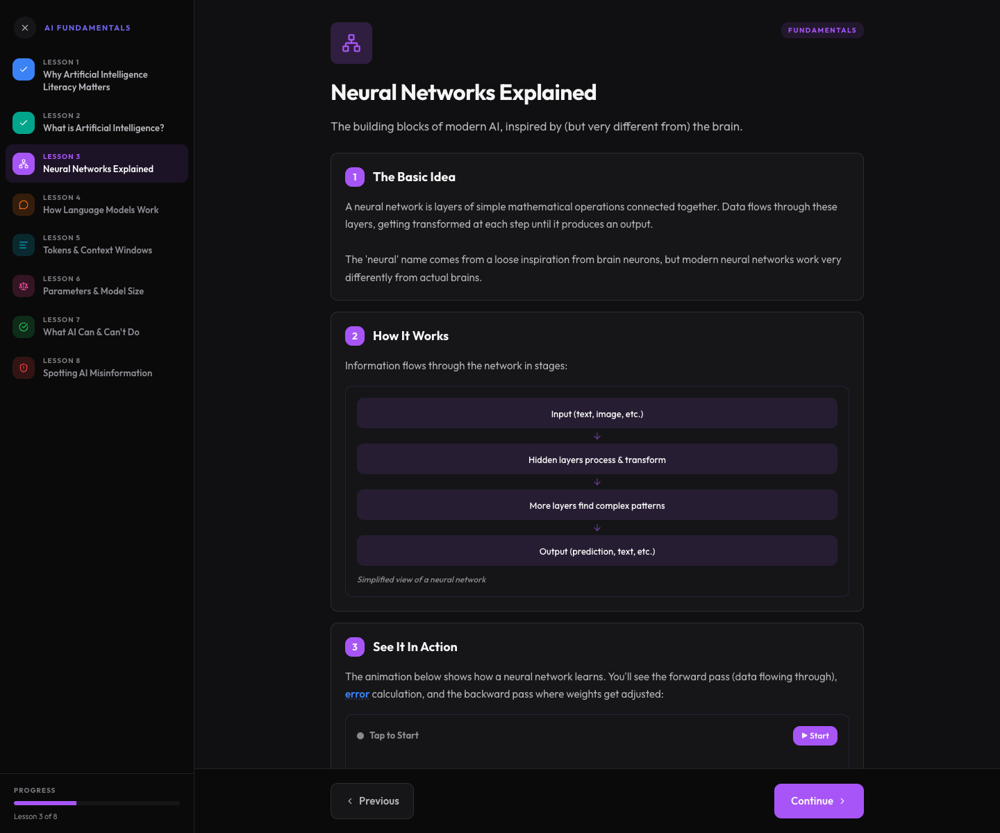

# AI Fact Checker

Verified information platform teaching what's truly happening under the hood of modern AI. Aggregates 50+ sources to fact-check models, providers, and capabilities across the industry.

**Live site:** https://web-tau-peach-63.vercel.app

Built by [Cade Kukk](https://cadekukk.vercel.app/) in collaboration with Dr. Blackwood and Professor Dolence at Longwood University.



## What's in this repo

| Path | Description |
|------|-------------|
| `web/` | The web application — Next.js (App Router), deployed to Vercel. This is the live, actively developed version. |
| `AI Fact Checker/` | The original SwiftUI iOS app the web version grew out of. |

## The web app

The front door is **Learn** — an 8-lesson animated mini-course (AI Fundamentals) covering neural networks, language models, tokens, parameters, and how to spot AI misinformation. Course progress is saved locally, so returning visitors pick up where they left off.

Behind it, four reference sections backed by a hand-curated, source-cited dataset:

- **Companies** (`/companies`) — 8 AI companies and 25+ models, each with specs, pricing, capabilities, known limitations, and myth vs. fact breakdowns.
- **Fact Check** (`/fact-check`) — verified answers to common AI questions, each tagged with a confidence level that reflects the strength of available evidence.
- **Compare** (`/compare`) — side-by-side model comparison across quality, speed, context, value, and versatility, with transparent scoring.
- **Sources** (`/sources`) — the 50+ primary sources behind every claim: official documentation, research papers, GitHub repositories, and news coverage.

A **⌘K search palette** covers everything — companies, models, fact-checked questions, and the full 68-term AI glossary, which opens in place from anywhere in the app. Terms are also inline-highlighted throughout.

Every page is a real URL, so lessons, model pages, comparisons, and searches are all shareable:

```text
/learn?lesson=3
/companies/openai/gpt54
/compare?models=gpt54,claudeopus47
/fact-check?q=Can%20AI%20think%3F
```



### Design

Dark, clean, and minimal — inspired by [micro1.ai](https://www.micro1.ai/):

- Near-black surfaces (`#0a0a0a`) with subtle white-alpha cards and hairline borders
- Violet brand accent (`#7065f0`)
- [Outfit](https://fonts.google.com/specimen/Outfit) geometric sans throughout, soft 10–14px corner rounding
- Small uppercase violet section kickers above each page title



### Tech stack

- [Next.js](https://nextjs.org/) (App Router) with React and TypeScript
- [Tailwind CSS v4](https://tailwindcss.com/)
- [lucide-react](https://lucide.dev/) icons
- [Resend](https://resend.com/) for the feedback endpoint (`/api/feedback`)
- Deployed on [Vercel](https://vercel.com/)

### Running locally

```bash
cd web
npm install
npm run dev
```

Open http://localhost:3000.

The feedback form requires two environment variables (optional for local development — the endpoint degrades gracefully without them):

```bash
RESEND_API_KEY=...      # from resend.com
FEEDBACK_RECIPIENT=...  # inbox for feedback, defaults to the author's
```

### Deploying

The `web/` directory is linked to the Vercel project `web`. Pushes to `main` deploy automatically; a manual deploy is:

```bash
cd web
npx vercel --prod
```

## Data

All model specs, pricing, benchmarks, and claims live in `web/data/` as typed TypeScript modules (`companies.ts`, `factcheck.ts`, `terms.ts`, `benchmarks.ts`, `lessons.ts`). Every claim traces back to a source listed in the Sources tab. Information is current as of early 2026 — AI moves fast; always verify against primary sources.
