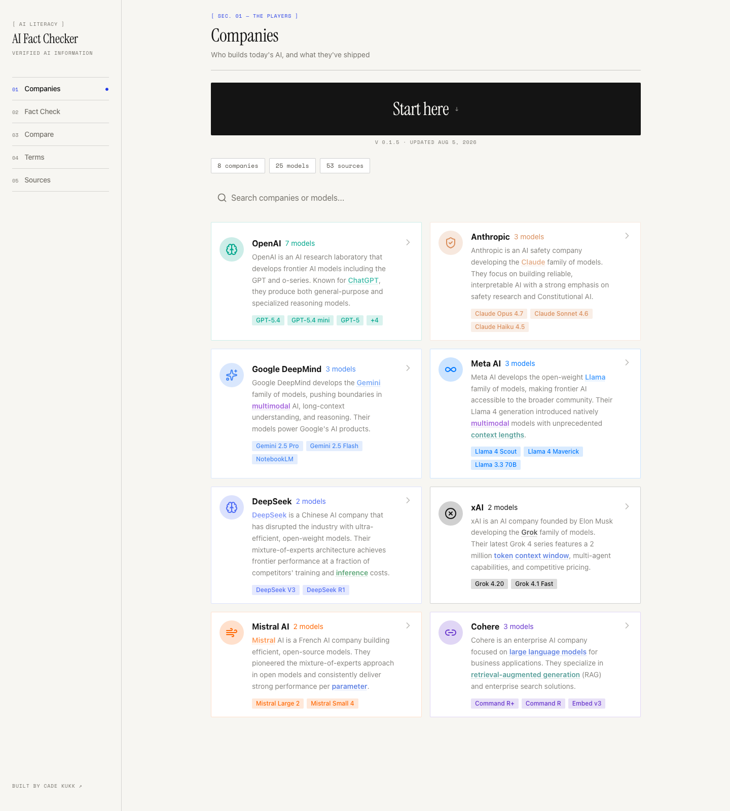

# AI Fact Checker

Verified information platform teaching what's truly happening under the hood of modern AI. Aggregates 50+ sources to fact-check models, providers, and capabilities across the industry.

**Live site:** https://web-tau-peach-63.vercel.app

Built by [Cade Kukk](https://cadekukk.vercel.app/) in collaboration with Dr. Blackwood and Professor Dolence at Longwood University.



## What's in this repo

| Path | Description |
|------|-------------|
| `web/` | The web application — Next.js (App Router), deployed to Vercel. This is the live, actively developed version. |
| `AI Fact Checker/` | The original SwiftUI iOS app the web version grew out of. |

## The web app

Five sections, all backed by a hand-curated, source-cited dataset:

- **Companies** — 8 AI companies and 25+ models, each with specs, pricing, capabilities, known limitations, and myth vs. fact breakdowns.
- **Fact Check** — verified answers to common AI questions, each tagged with a confidence level that reflects the strength of available evidence.
- **Compare** — side-by-side model comparison across quality, speed, context, value, and versatility, with transparent scoring.
- **Terms** — a 68-term AI glossary organized by category, with inline term highlighting throughout the app.
- **Sources** — the 50+ primary sources behind every claim: official documentation, research papers, GitHub repositories, and news coverage.

There's also a built-in **AI Fundamentals mini-course** ("Start here") — 8 animated lessons covering neural networks, language models, tokens, parameters, and how to spot AI misinformation.


### Design

The UI follows the editorial "paper and ink" design language of [cadekukk.vercel.app](https://cadekukk.vercel.app/):

- Warm paper background (`#f7f6f2`) with near-black ink (`#141414`) and hairline rules
- Electric blue accent (`#2038e6`)
- Instrument Serif for display headings, Space Mono for uppercase micro-labels
- Numbered sections (`[ SEC. 01 — THE PLAYERS ]`) and sharp, bordered cards

### Tech stack

- [Next.js](https://nextjs.org/) (App Router) with React and TypeScript
- [Tailwind CSS v4](https://tailwindcss.com/)
- [lucide-react](https://lucide.dev/) icons
- [Resend](https://resend.com/) for the feedback endpoint (`/api/feedback`)
- Deployed on [Vercel](https://vercel.com/)

### Running locally

```bash
cd web
npm install
npm run dev
```

Open http://localhost:3000.

The feedback form requires two environment variables (optional for local development — the endpoint degrades gracefully without them):

```bash
RESEND_API_KEY=...      # from resend.com
FEEDBACK_RECIPIENT=...  # inbox for feedback, defaults to the author's
```

### Deploying

The `web/` directory is linked to the Vercel project `web`. Pushes to `main` deploy automatically; a manual deploy is:

```bash
cd web
npx vercel --prod
```

## Data

All model specs, pricing, benchmarks, and claims live in `web/data/` as typed TypeScript modules (`companies.ts`, `factcheck.ts`, `terms.ts`, `benchmarks.ts`, `lessons.ts`). Every claim traces back to a source listed in the Sources tab. Information is current as of early 2026 — AI moves fast; always verify against primary sources.
